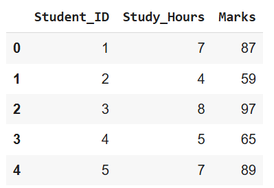

# Linear Regression

Predict students’ marks based on the number of hours they study using linear regression. This project demonstrates both manual calculation and Python implementation.


# Overview

1. Linear regression is a simple way to predict a continuous outcome (marks) from an independent variable (study hours).
This project includes:

2. Calculating slope (m) and intercept (b) manually

3. Predicting marks for given study hours

4. Visualizing the regression line with actual data points

5. Working with a dataset of 100 students (student_dataset_capped.csv)

## Dataset

The CSV file contains 100 students:



## Program
####  1. Load Dataset
```py
import pandas as pd

df = pd.read_csv("student_dataset_capped.csv")
X = df[["Study_Hours"]].values  # Independent variable
y = df["Marks"].values          # Dependent variable
```
####  2. Manual Linear Regression
```py
import numpy as np

# Calculate means
x_mean = np.mean(X)
y_mean = np.mean(y)

# Calculate slope (m)
m = np.sum((X - x_mean)*(y - y_mean)) / np.sum((X - x_mean)**2)

# Calculate intercept (b)
b = y_mean - m * x_mean

print(f"Regression equation: y = {m:.2f}x + {b:.2f}")
```

#### 3.Predict Marks
```py
def predict(x):
    return m * x + b

# Predict marks for new study hours
x_new = np.array([[6], [7.5], [9]])
y_pred = predict(x_new)
print("Predicted Marks:", y_pred)
```

####  4. Visualize Regression
```py
import matplotlib.pyplot as plt

x_line = np.linspace(min(X), max(X), 100)
y_line = predict(x_line)

plt.scatter(X, y, color='blue', label='Actual Marks')
plt.plot(x_line, y_line, color='red', label='Regression Line')
plt.scatter(x_new, y_pred, color='green', marker='x', s=100, label='Predictions')
plt.xlabel("Study Hours")
plt.ylabel("Marks")
plt.legend()
plt.show()
